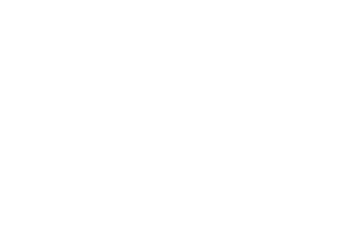
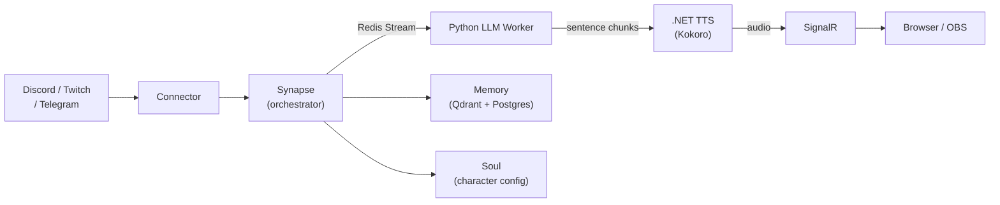

<div align="center">
  <picture>
    <source media="(prefers-color-scheme: dark)" srcset="apps/web/public/logo/icon_white_horizontal.svg">
    <source media="(prefers-color-scheme: light)" srcset="apps/web/public/logo/icon_black.svg">
    
  </picture>
</div>
<br>

<p align="center">
  <a href="https://github.com/YOUR_ORG/inktide/actions/workflows/ci.yml"></a>
  <a href="LICENSE"></a>
  
  
  
  
  
</p>

## Inktide

Inktide is an AI companion for live streams. It reads Discord, Twitch, and Telegram chat and replies in voice. TTS starts on the first sentence while the LLM is still generating the rest - so there's no wait between generation and synthesis.

## Quick start

Requires .NET 10 SDK, Node.js LTS, and Docker.

```bash
cp .env.example .env          # fill in every CHANGE_ME__* value
docker compose --profile core up -d
dotnet run --project src/Inktide.API
cd apps/web && npm install && npm run dev   # http://localhost:3000
```

> **Profiles:** `--profile core` starts Postgres, Keycloak, Redis, MinIO. Add `--profile dev` for MailHog, `--profile workers` for Python AI workers.

## Repository layout

| Path | Stack | Description |
|---|---|---|
| `src/` | .NET 10 | API host + 18 bounded-context modules (`Inktide.API.sln`) |
| `apps/web/` | Next.js 16 / TS | Web frontend (Feature-Sliced Design) |
| `crates/` | Rust | VRM rendering, audio, lipsync |
| `fast-api/` | Python / FastAPI | LLM worker, embedding workers |
| `keycloak/` | Java / Keycloakify | Custom theme + Twitch OAuth provider |
| `tools/pipeline-bench/` | Node.js | End-to-end latency benchmark |
| `docs/` | — | DB schema (`schema.sql`, `schema.dbml`) |

## Architecture



## Development

```bash
# Python AI workers
cd fast-api/ai-worker/llm-worker              && pip install -e ".[dev]" && uvicorn app.main:app --port 8000
cd fast-api/ai-worker/embeddings/scribe-model  && pip install -e ".[dev]" && uvicorn app.main:app --port 8001

# Rust crates
cd crates && cargo build && cargo test

# Keycloak theme
cd keycloak/theme && npm install && npm run build-keycloak-theme

# Keycloak Twitch provider
cd keycloak/twitch-provider && mvn clean package -DskipTests
```

## Testing

```bash
dotnet test Inktide.API.sln
cd apps/web && npm run test
cd crates   && cargo test
cd fast-api/ai-worker/llm-worker && pytest -q
```
