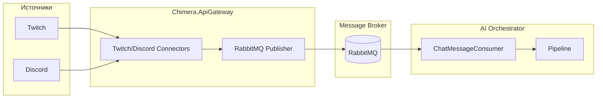
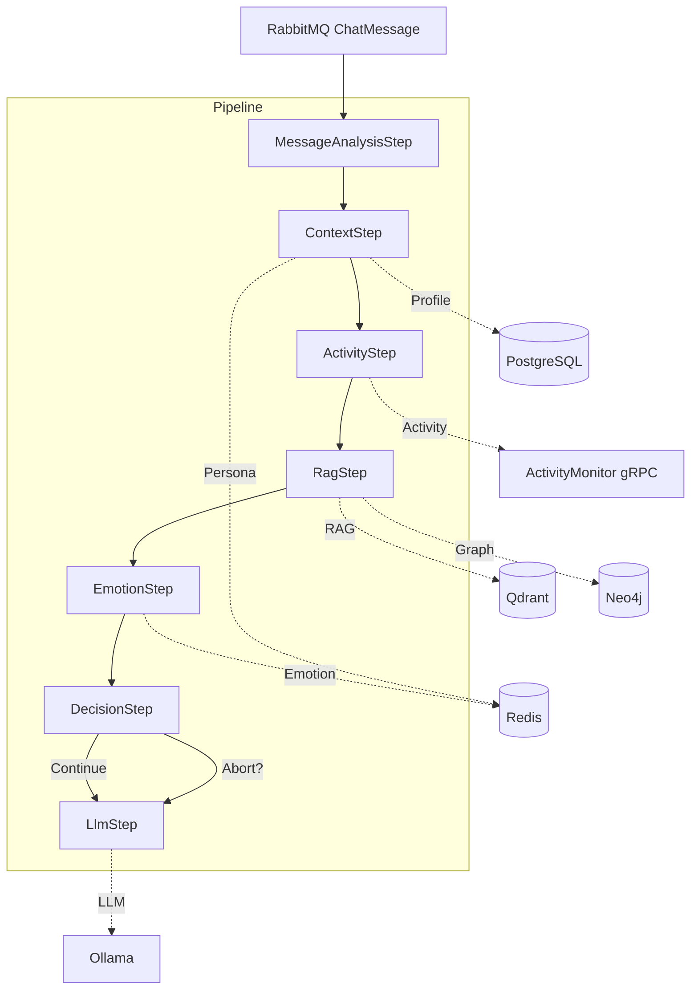

# Chimera.AI.Orchestrator — Архитектура

## Назначение

AI Orchestrator — это **сервис обработки чат-сообщений** из Twitch и Discord. Он получает сообщения из RabbitMQ, прогоняет их через пайплайн (анализ, RAG, эмоции, LLM) и в итоге генерирует ответ ИИ для стримера.

**В одном предложении:** получает чат → обогащает контекстом → решает, отвечать ли → генерирует ответ через LLM.

---

## Поток данных

**Сообщение:** Exchange `chimera.streaming`, RoutingKey `chat.message`, Queue `stream_input`.

---

## Структура сообщения (ChatMessage)

| Поле | Тип | Описание |
|------|-----|----------|
| PlatformId | string | "twitch" / "discord" |
| ChannelId | string | ID канала (broadcaster/user) |
| ChannelName | string | Имя канала |
| Sender | UserMetadata | Автор сообщения |
| Text | string | Текст сообщения |
| Timestamp | DateTimeOffset | Время |
| Stream | StreamInfo? | Статус стрима (опционально) |

**UserMetadata:** UserId, UserName, Badges, IsModerator, IsSubscriber, IsVip, IsBroadcaster, Color.

---

## Пайплайн (Pipeline)

Папка: [Chimera.AI.Orchestrator.Infrastructure/Pipeline/](services/Chimera.AI.Orchestrator/Chimera.AI.Orchestrator.Infrastructure/Pipeline/)

Шаги выполняются **последовательно**. Контекст передаётся через `MessageProcessingContext` — можно вызывать `context.Set<T>()` и `context.Get<T>()`. При `context.Abort()` дальнейшие шаги не выполняются.

| # | Шаг | Назначение | Статус |
|---|-----|------------|--------|
| 1 | **MessageAnalysisStep** | Анализ сообщения: sentiment, toxicity, intent, named entities (ONNX) | TODO |
| 2 | **ContextStep** | Загрузка PersonaSettings, StreamerProfile, ViewerProfile из Redis/PostgreSQL | TODO |
| 3 | **ActivityStep** | Текущая игровая активность (Chimera.ActivityMonitor via gRPC) — игра, сцена, объекты | TODO |
| 4 | **RagStep** | RAG: поиск в Qdrant + граф Neo4j, релевантные фрагменты диалога | TODO |
| 5 | **EmotionStep** | Эмоциональное состояние к зрителю (FriendShip, Happiness, Stress) | TODO |
| 6 | **DecisionStep** | Решение: отвечать или нет; приоритет (донат 100%, подписка 70%, обычный 10%); задержка набора | TODO |
| 7 | **LlmStep** | Сборка промпта из Persona + GameActivity + RAG + Emotion → вызов Ollama | TODO |

---

## Зависимости (appsettings.json)

| Настройка | Значение | Описание |
|-----------|----------|----------|
| **RabbitMqSettings** | localhost:5672 | Подписка на очередь `stream_input` |
| **OllamaSettings** | localhost:11434 | LLM (Ollama) |
| **QdrantSettings** | localhost:6334 (gRPC) | Векторная БД для RAG |
| **Server** | 127.0.0.1:9090 | HTTP (health, будущие API) |

---

## Проекты (слои)

| Проект | Назначение |
|--------|------------|
| **Chimera.AI.Orchestrator** | Host, Program, Startup, DryIoc |
| **Chimera.AI.Orchestrator.Core** | Интерфейсы (IStartup, IPipelineStep, IWebHostConfigurator) |
| **Chimera.AI.Orchestrator.Application** | Модели (ChatMessage, UserMetadata, MessageProcessingContext), Pipeline, IPipelineStep |
| **Chimera.AI.Orchestrator.Infrastructure** | RabbitMQ consumer, шаги пайплайна, PipelineStartup |

---

## Связь с другими сервисами

| Сервис | Направление | Протокол | Описание |
|--------|-------------|----------|----------|
| **Chimera.Streaming.Host** (Twitch/Discord) | → RabbitMQ | AMQP | Публикует ChatMessage |
| **Chimera.Characters.API** | Orchestrator → | HTTP/gRPC | Persona, промпты, поведение |
| **Chimera.ActivityMonitor** | Orchestrator → | gRPC | Игровая активность (YOLO, scene) |
| **Chimera.RAG** | Orchestrator → | gRPC | Векторный поиск, граф |
| **Ollama** | Orchestrator → | HTTP | LLM inference |
| **Qdrant** | Orchestrator → | gRPC | Векторное хранилище |

**Chimera.ActivityMonitor** и **Chimera.RAG** — сервисы из TODO; в коде пока заготовки.

---

## Выход пайплайна

Сейчас LlmStep не реализован. В перспективе:
- Текст ответа → в контекст
- Далее (за пределами текущего пайплайна): TTS → аудио → публикация в RabbitMQ/стрим

---

## Схема пайплайна

---

## Docker

В [docker-compose](services/Chimera.AI.Orchestrator/deploy/docker-compose.yml): RabbitMQ, Qdrant, Ollama (с GPU). AI Orchestrator добавляется отдельным сервисом.
