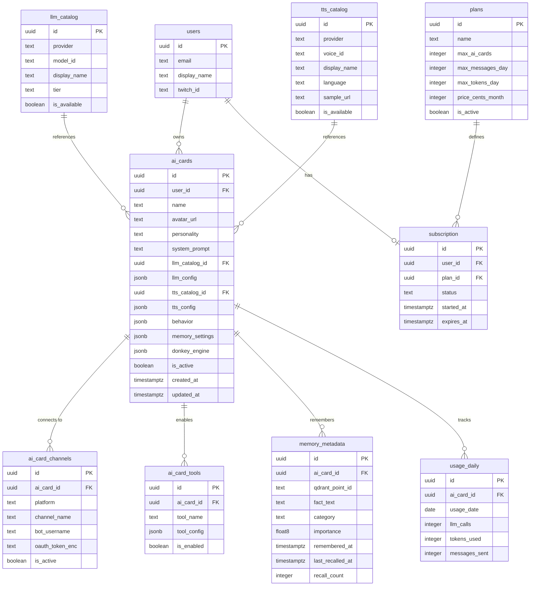

# Chimera — PostgreSQL Schema for AI Cards

> 10 tables total. Designed for MVP delivery in ~2 weeks.
> Existing `users` table untouched — all new tables reference `users(id)`.

---

## ER Diagram (Mermaid)



---

## SQL Schema

### 1. `llm_catalog` — Global registry of available LLM models

```sql
CREATE TABLE llm_catalog (
    id              UUID PRIMARY KEY DEFAULT gen_random_uuid(),
    provider        TEXT NOT NULL,                -- 'openai', 'anthropic', 'ollama'
    model_id        TEXT NOT NULL,                -- 'gpt-4o', 'claude-sonnet-4-20250514', 'llama3'
    display_name    TEXT NOT NULL,                -- human-readable name for UI
    tier            TEXT NOT NULL DEFAULT 'free', -- 'free', 'pro', 'enterprise'
    is_available    BOOLEAN NOT NULL DEFAULT TRUE,
    created_at      TIMESTAMPTZ NOT NULL DEFAULT now(),

    UNIQUE (provider, model_id)
);
```

**Rationale**: Separates "what models exist" from "what model a card uses." Admins manage this catalog. The `tier` column controls which plans can access which models. Adding a new model = one INSERT, zero code changes.

---

### 2. `tts_catalog` — Global registry of available TTS voices

```sql
CREATE TABLE tts_catalog (
    id              UUID PRIMARY KEY DEFAULT gen_random_uuid(),
    provider        TEXT NOT NULL,                -- 'elevenlabs', 'azure', 'silero'
    voice_id        TEXT NOT NULL,                -- provider-specific voice identifier
    display_name    TEXT NOT NULL,
    language        TEXT NOT NULL DEFAULT 'en',
    gender          TEXT,                         -- 'male', 'female', 'neutral'
    sample_url      TEXT,                         -- URL to audio preview
    tier            TEXT NOT NULL DEFAULT 'free',
    is_available    BOOLEAN NOT NULL DEFAULT TRUE,
    created_at      TIMESTAMPTZ NOT NULL DEFAULT now(),

    UNIQUE (provider, voice_id)
);
```

**Rationale**: Same pattern as `llm_catalog`. Decouples available voices from per-card selection. `sample_url` lets the frontend play a preview without calling the TTS API.

---

### 3. `ai_cards` — The core entity: one AI companion configuration

```sql
CREATE TABLE ai_cards (
    id              UUID PRIMARY KEY DEFAULT gen_random_uuid(),
    user_id         UUID NOT NULL REFERENCES users(id) ON DELETE CASCADE,
    name            TEXT NOT NULL,                        -- "Neuro-chan", "DJ Bot"
    slug            TEXT NOT NULL,                        -- URL-safe unique name per user
    avatar_url      TEXT,
    personality     TEXT NOT NULL DEFAULT '',             -- short personality description for UI
    system_prompt   TEXT NOT NULL,                        -- the main LLM system prompt

    -- LLM configuration
    llm_catalog_id  UUID NOT NULL REFERENCES llm_catalog(id),
    llm_config      JSONB NOT NULL DEFAULT '{
        "temperature": 0.8,
        "max_tokens": 512,
        "top_p": 0.95,
        "frequency_penalty": 0.0,
        "presence_penalty": 0.0
    }'::jsonb,

    -- TTS configuration (nullable = TTS disabled)
    tts_catalog_id  UUID REFERENCES tts_catalog(id),
    tts_config      JSONB DEFAULT '{
        "speed": 1.0,
        "pitch": 1.0,
        "stability": 0.5,
        "similarity_boost": 0.75
    }'::jsonb,

    -- Behavior settings
    behavior        JSONB NOT NULL DEFAULT '{
        "response_delay_ms": 1500,
        "max_response_length": 400,
        "auto_moderate": true,
        "language": "en",
        "typing_simulation": true
    }'::jsonb,

    -- Memory settings
    memory_settings JSONB NOT NULL DEFAULT '{
        "enabled": true,
        "max_memories": 1000,
        "retention_days": 90,
        "importance_threshold": 0.3
    }'::jsonb,

    -- Donkey Engine (autonomous behavior)
    donkey_engine   JSONB NOT NULL DEFAULT '{
        "enabled": true,
        "idle_timeout_seconds": 120,
        "min_interval_seconds": 30,
        "mood": {
            "default_valence": 0.6,
            "default_arousal": 0.5,
            "decay_rate": 0.01
        },
        "drives": {
            "social": 0.7,
            "curiosity": 0.5,
            "humor": 0.6,
            "energy": 0.8
        }
    }'::jsonb,

    is_active       BOOLEAN NOT NULL DEFAULT TRUE,
    created_at      TIMESTAMPTZ NOT NULL DEFAULT now(),
    updated_at      TIMESTAMPTZ NOT NULL DEFAULT now(),

    UNIQUE (user_id, slug)
);

CREATE INDEX idx_ai_cards_user_id ON ai_cards(user_id);
CREATE INDEX idx_ai_cards_user_active ON ai_cards(user_id, is_active) WHERE is_active = TRUE;
```

**Rationale**: This is the "soul container." All frequently-read-together config lives in one row to avoid JOINs on every chat message. JSONB for `llm_config`, `tts_config`, `behavior`, `memory_settings`, `donkey_engine` because:

- These are **read-heavy, write-rare** blobs — streamer configures once, bot reads thousands of times
- Internal structure varies per provider (ElevenLabs TTS has `stability`/`similarity_boost`, Azure has different params)
- No need to query individual fields inside these JSONBs (we always load the whole card)
- Adding new config fields = zero migrations

Normalized columns (`name`, `system_prompt`, `llm_catalog_id`, `tts_catalog_id`, `is_active`) are things we **filter/search/JOIN on**.

---

### 4. `ai_card_channels` — Twitch/YouTube/Discord connections per card

```sql
CREATE TABLE ai_card_channels (
    id              UUID PRIMARY KEY DEFAULT gen_random_uuid(),
    ai_card_id      UUID NOT NULL REFERENCES ai_cards(id) ON DELETE CASCADE,
    platform        TEXT NOT NULL DEFAULT 'twitch',       -- 'twitch', 'youtube', 'discord'
    channel_name    TEXT NOT NULL,                         -- 'xqc', 'shroud'
    channel_id      TEXT,                                  -- platform-specific channel ID
    bot_username    TEXT NOT NULL,                         -- bot's display name in chat
    oauth_token_enc TEXT,                                  -- encrypted OAuth token
    is_active       BOOLEAN NOT NULL DEFAULT TRUE,
    connected_at    TIMESTAMPTZ,
    created_at      TIMESTAMPTZ NOT NULL DEFAULT now(),

    UNIQUE (ai_card_id, platform, channel_name)
);

CREATE INDEX idx_ai_card_channels_card ON ai_card_channels(ai_card_id);
CREATE INDEX idx_ai_card_channels_active ON ai_card_channels(platform, is_active)
    WHERE is_active = TRUE;
```

**Rationale**: Separate table because one AI card can be deployed to multiple channels simultaneously (e.g., Twitch + Discord). The `oauth_token_enc` is encrypted at the application layer — never stored in plaintext. The unique constraint prevents duplicate connections.

---

### 5. `ai_card_tools` — Enabled tools/capabilities per card

```sql
CREATE TABLE ai_card_tools (
    id              UUID PRIMARY KEY DEFAULT gen_random_uuid(),
    ai_card_id      UUID NOT NULL REFERENCES ai_cards(id) ON DELETE CASCADE,
    tool_name       TEXT NOT NULL,                         -- 'web_search', 'calculator', 'weather'
    tool_config     JSONB NOT NULL DEFAULT '{}'::jsonb,    -- tool-specific settings
    is_enabled      BOOLEAN NOT NULL DEFAULT TRUE,
    created_at      TIMESTAMPTZ NOT NULL DEFAULT now(),

    UNIQUE (ai_card_id, tool_name)
);

CREATE INDEX idx_ai_card_tools_card ON ai_card_tools(ai_card_id);
```

**Rationale**: Tools are a many-to-many relationship with variable config per tool. `tool_config` is JSONB because each tool has completely different parameters (web_search might have `max_results`, calculator has nothing, weather has `default_city`). Normalized table instead of a JSONB array on `ai_cards` because we may want to query "how many cards use web_search" for analytics.

---

### 6. `memory_metadata` — PostgreSQL mirror of Qdrant memory vectors

```sql
CREATE TABLE memory_metadata (
    id              UUID PRIMARY KEY DEFAULT gen_random_uuid(),
    ai_card_id      UUID NOT NULL REFERENCES ai_cards(id) ON DELETE CASCADE,
    qdrant_point_id TEXT NOT NULL,                         -- reference to Qdrant vector
    fact_text       TEXT NOT NULL,                         -- the extracted fact
    category        TEXT NOT NULL DEFAULT 'general',       -- 'personal', 'preference', 'event', 'general'
    source_type     TEXT NOT NULL DEFAULT 'chat',          -- 'chat', 'donkey_engine', 'manual'
    importance      FLOAT8 NOT NULL DEFAULT 0.5,           -- 0.0 to 1.0
    remembered_at   TIMESTAMPTZ NOT NULL DEFAULT now(),
    last_recalled_at TIMESTAMPTZ,
    recall_count    INTEGER NOT NULL DEFAULT 0,
    expires_at      TIMESTAMPTZ,                           -- NULL = never expires

    UNIQUE (ai_card_id, qdrant_point_id)
);

CREATE INDEX idx_memory_card ON memory_metadata(ai_card_id);
CREATE INDEX idx_memory_importance ON memory_metadata(ai_card_id, importance DESC);
CREATE INDEX idx_memory_category ON memory_metadata(ai_card_id, category);
CREATE INDEX idx_memory_expiry ON memory_metadata(expires_at)
    WHERE expires_at IS NOT NULL;
```

**Rationale**: Qdrant handles vector similarity search, but we need structured metadata in PostgreSQL for:
- Counting memories per card (quota enforcement)
- Expiry/retention cleanup via `expires_at` (cron job deletes expired rows + Qdrant points)
- Analytics (most recalled facts, category distribution)
- Cascading delete when an AI card is removed

`fact_text` is duplicated here intentionally — avoids a Qdrant round-trip when displaying memory lists in the UI.

---

### 7. `plans` — Subscription tiers

```sql
CREATE TABLE plans (
    id                  UUID PRIMARY KEY DEFAULT gen_random_uuid(),
    name                TEXT NOT NULL UNIQUE,              -- 'free', 'pro', 'enterprise'
    display_name        TEXT NOT NULL,                     -- 'Free', 'Pro', 'Enterprise'
    max_ai_cards        INTEGER NOT NULL,                  -- 1, 5, 50
    max_messages_day    INTEGER NOT NULL,                  -- 1000, -1 (unlimited)
    max_tokens_day      INTEGER NOT NULL,                  -- 50000, -1 (unlimited)
    max_memories        INTEGER NOT NULL DEFAULT 500,      -- per AI card
    allowed_model_tiers TEXT[] NOT NULL DEFAULT '{free}',  -- '{free}', '{free,pro}'
    price_cents_month   INTEGER NOT NULL DEFAULT 0,
    price_cents_year    INTEGER,                           -- NULL = no yearly option
    is_active           BOOLEAN NOT NULL DEFAULT TRUE,
    created_at          TIMESTAMPTZ NOT NULL DEFAULT now()
);
```

**Rationale**: Static lookup table managed by admins. `-1` means unlimited. `allowed_model_tiers` is a `TEXT[]` array — simple to check with `@>` operator: `WHERE plan.allowed_model_tiers @> ARRAY['pro']`. Avoids a join table for this simple relationship.

---

### 8. `subscriptions` — User's active subscription

```sql
CREATE TABLE subscriptions (
    id              UUID PRIMARY KEY DEFAULT gen_random_uuid(),
    user_id         UUID NOT NULL REFERENCES users(id) ON DELETE CASCADE,
    plan_id         UUID NOT NULL REFERENCES plans(id),
    status          TEXT NOT NULL DEFAULT 'active',        -- 'active', 'cancelled', 'past_due', 'trialing'
    payment_provider TEXT,                                  -- 'stripe', 'paddle', NULL for free
    external_sub_id TEXT,                                   -- Stripe subscription ID
    started_at      TIMESTAMPTZ NOT NULL DEFAULT now(),
    current_period_end TIMESTAMPTZ,                         -- when current billing period ends
    cancelled_at    TIMESTAMPTZ,
    created_at      TIMESTAMPTZ NOT NULL DEFAULT now(),
    updated_at      TIMESTAMPTZ NOT NULL DEFAULT now()
);

CREATE UNIQUE INDEX idx_subscriptions_user_active
    ON subscriptions(user_id) WHERE status IN ('active', 'trialing');
CREATE INDEX idx_subscriptions_expiry ON subscriptions(current_period_end)
    WHERE status = 'active';
```

**Rationale**: One active subscription per user (enforced by partial unique index). History is preserved — old rows stay with `status = 'cancelled'`. `external_sub_id` links to Stripe/Paddle for webhook reconciliation. The partial index on `current_period_end` enables efficient "expiring soon" queries for renewal reminders.

---

### 9. `usage_daily` — Daily usage counters per AI card

```sql
CREATE TABLE usage_daily (
    id              UUID PRIMARY KEY DEFAULT gen_random_uuid(),
    ai_card_id      UUID NOT NULL REFERENCES ai_cards(id) ON DELETE CASCADE,
    usage_date      DATE NOT NULL DEFAULT CURRENT_DATE,
    llm_calls       INTEGER NOT NULL DEFAULT 0,
    tokens_prompt   INTEGER NOT NULL DEFAULT 0,
    tokens_completion INTEGER NOT NULL DEFAULT 0,
    messages_received INTEGER NOT NULL DEFAULT 0,
    messages_sent   INTEGER NOT NULL DEFAULT 0,
    tts_characters  INTEGER NOT NULL DEFAULT 0,
    donkey_thoughts INTEGER NOT NULL DEFAULT 0,            -- autonomous messages generated

    UNIQUE (ai_card_id, usage_date)
);

CREATE INDEX idx_usage_daily_date ON usage_daily(usage_date);
CREATE INDEX idx_usage_daily_card_date ON usage_daily(ai_card_id, usage_date DESC);
```

**Rationale**: Pre-aggregated daily counters instead of per-event logging. Updated via `INSERT ... ON CONFLICT DO UPDATE SET llm_calls = llm_calls + 1` (upsert pattern — zero-lock atomic increment). One row per card per day keeps the table small. Quota checks: `SELECT SUM(messages_sent) FROM usage_daily WHERE ai_card_id = $1 AND usage_date = CURRENT_DATE`.

Split `tokens_prompt` / `tokens_completion` because they have different costs. `donkey_thoughts` tracks autonomous behavior separately for billing clarity.

---

### 10. `audit_log` — Lightweight change tracking

```sql
CREATE TABLE audit_log (
    id              UUID PRIMARY KEY DEFAULT gen_random_uuid(),
    user_id         UUID NOT NULL REFERENCES users(id),
    entity_type     TEXT NOT NULL,                         -- 'ai_card', 'channel', 'subscription'
    entity_id       UUID NOT NULL,
    action          TEXT NOT NULL,                         -- 'created', 'updated', 'deleted', 'activated'
    changes         JSONB,                                 -- {"system_prompt": {"old": "...", "new": "..."}}
    ip_address      INET,
    created_at      TIMESTAMPTZ NOT NULL DEFAULT now()
);

CREATE INDEX idx_audit_user ON audit_log(user_id, created_at DESC);
CREATE INDEX idx_audit_entity ON audit_log(entity_type, entity_id, created_at DESC);
```

**Rationale**: Replaces full versioning for MVP. Instead of maintaining version chains, we log diffs. This covers the "what changed and when" use case without the complexity of version tables. `changes` JSONB stores only the modified fields with old/new values — compact and queryable. Can be promoted to full versioning later if needed.

---

## Summary: JSONB vs Normalized Columns

| Field | Storage | Why |
|---|---|---|
| `ai_cards.llm_config` | **JSONB** | Provider-specific params, read as blob, never filtered on |
| `ai_cards.tts_config` | **JSONB** | Same — varies per provider, read-only blob |
| `ai_cards.behavior` | **JSONB** | Stable set of knobs, but may grow; never queried individually |
| `ai_cards.memory_settings` | **JSONB** | Simple on/off + thresholds, read as unit |
| `ai_cards.donkey_engine` | **JSONB** | Nested structure (mood, drives), evolving schema |
| `ai_card_tools.tool_config` | **JSONB** | Each tool has unique params |
| `audit_log.changes` | **JSONB** | Arbitrary diff structure |
| `ai_cards.name` | **Column** | Searched, displayed in lists |
| `ai_cards.system_prompt` | **Column** | Large text, but always loaded with the card |
| `ai_cards.is_active` | **Column** | Filtered on in every query |
| `ai_cards.llm_catalog_id` | **FK Column** | JOINed for model validation and tier checks |
| `plans.allowed_model_tiers` | **TEXT[]** | Simple containment check, avoids join table |

**Rule of thumb**: If you filter/sort/JOIN on it, it's a column. If you load it as a blob and the structure varies, it's JSONB.

---

## Index Strategy

| Index | Purpose |
|---|---|
| `idx_ai_cards_user_id` | List all cards for a user |
| `idx_ai_cards_user_active` | Partial — only active cards (hot path) |
| `idx_ai_card_channels_active` | Find all active connections per platform (for connector service startup) |
| `idx_memory_importance` | Top-N memories by importance for recall |
| `idx_memory_expiry` | Partial — cleanup job finds expired memories |
| `idx_subscriptions_user_active` | Partial unique — enforce one active sub per user |
| `idx_subscriptions_expiry` | Renewal reminder queries |
| `idx_usage_daily_card_date` | Quota check: today's usage for a specific card |
| `idx_audit_entity` | "Show me history of this AI card" |

All partial indexes (`WHERE condition`) reduce index size and improve write performance by only indexing relevant rows.

---

## Seed Data

```sql
-- Plans
INSERT INTO plans (name, display_name, max_ai_cards, max_messages_day, max_tokens_day, max_memories, allowed_model_tiers, price_cents_month) VALUES
    ('free',       'Free',       1,  1000,   50000,  500,  '{free}',         0),
    ('pro',        'Pro',        5,  -1,     -1,     5000, '{free,pro}',     999),
    ('enterprise', 'Enterprise', 50, -1,     -1,     50000,'{free,pro,enterprise}', 4999);

-- LLM Catalog
INSERT INTO llm_catalog (provider, model_id, display_name, tier) VALUES
    ('ollama',    'llama3',              'Llama 3 (Local)',       'free'),
    ('ollama',    'mistral',             'Mistral 7B (Local)',    'free'),
    ('openai',    'gpt-4o-mini',         'GPT-4o Mini',           'free'),
    ('openai',    'gpt-4o',              'GPT-4o',                'pro'),
    ('anthropic', 'claude-sonnet-4-20250514',    'Claude Sonnet',         'pro'),
    ('anthropic', 'claude-opus-4-20250514',      'Claude Opus',           'enterprise');

-- TTS Catalog
INSERT INTO tts_catalog (provider, voice_id, display_name, language, gender, tier) VALUES
    ('silero',      'v3_en',          'Silero English',     'en', 'female', 'free'),
    ('elevenlabs',  'rachel',         'Rachel',             'en', 'female', 'pro'),
    ('elevenlabs',  'adam',           'Adam',               'en', 'male',   'pro'),
    ('azure',       'en-US-JennyNeural', 'Jenny (Azure)',  'en', 'female', 'pro');
```

---

## What's NOT Here (Intentionally)

| Feature | Why Deferred | When to Add |
|---|---|---|
| **Versioning** | `audit_log` covers "what changed" for now | When users request "rollback to previous prompt" |
| **Sharing / Templates** | Adds `visibility`, `forked_from`, `likes` columns | When community features are prioritized |
| **Marketplace** | Needs `products`, `purchases`, `reviews` tables | After monetization strategy is validated |
| **A/B Testing** | Needs `experiments`, `variants`, `metrics` tables | After baseline analytics are in place |
| **Multi-region** | Needs `region` column on cards + routing logic | When latency becomes an issue at scale |

Each of these is a ~2-4 table addition that can be layered on without modifying the core schema.

---

## Quick Reference: Application-Level Patterns

**Loading an AI Card for the pipeline** (one query, zero JOINs):
```sql
SELECT * FROM ai_cards WHERE id = $1 AND is_active = TRUE;
```
All config is in JSONB columns — deserialize in application code.

**Quota check before sending a message**:
```sql
SELECT ud.messages_sent, p.max_messages_day
FROM usage_daily ud
JOIN ai_cards ac ON ac.id = ud.ai_card_id
JOIN subscriptions s ON s.user_id = ac.user_id AND s.status = 'active'
JOIN plans p ON p.id = s.plan_id
WHERE ud.ai_card_id = $1 AND ud.usage_date = CURRENT_DATE;
```

**Atomic usage increment** (upsert):
```sql
INSERT INTO usage_daily (ai_card_id, usage_date, messages_sent, tokens_prompt, tokens_completion)
VALUES ($1, CURRENT_DATE, 1, $2, $3)
ON CONFLICT (ai_card_id, usage_date)
DO UPDATE SET
    messages_sent = usage_daily.messages_sent + 1,
    tokens_prompt = usage_daily.tokens_prompt + EXCLUDED.tokens_prompt,
    tokens_completion = usage_daily.tokens_completion + EXCLUDED.tokens_completion;
```

**Memory cleanup cron** (run daily):
```sql
DELETE FROM memory_metadata
WHERE expires_at IS NOT NULL AND expires_at < now();
```
