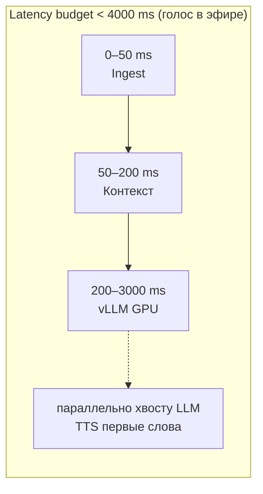
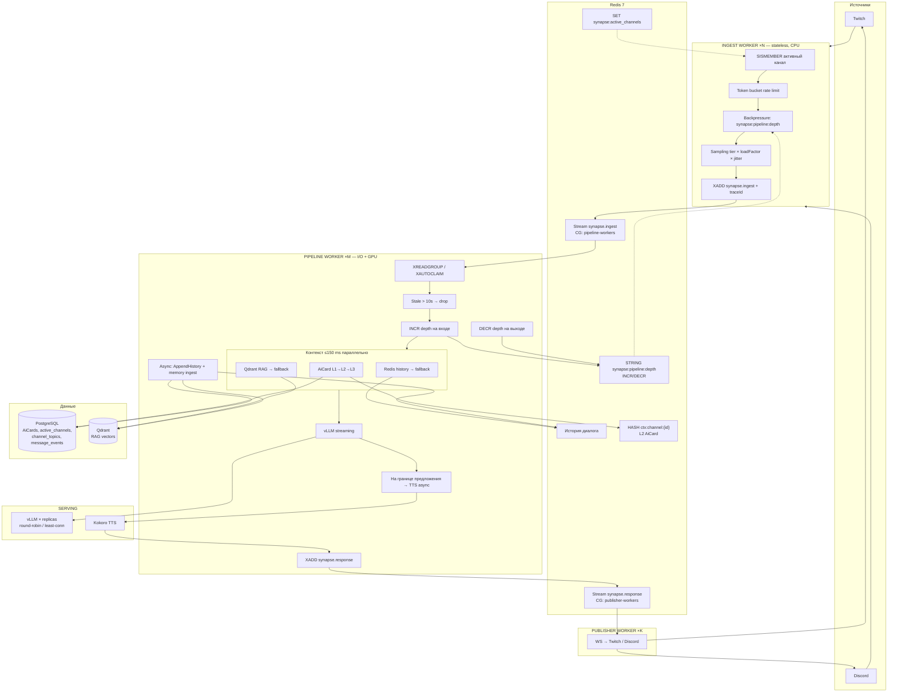
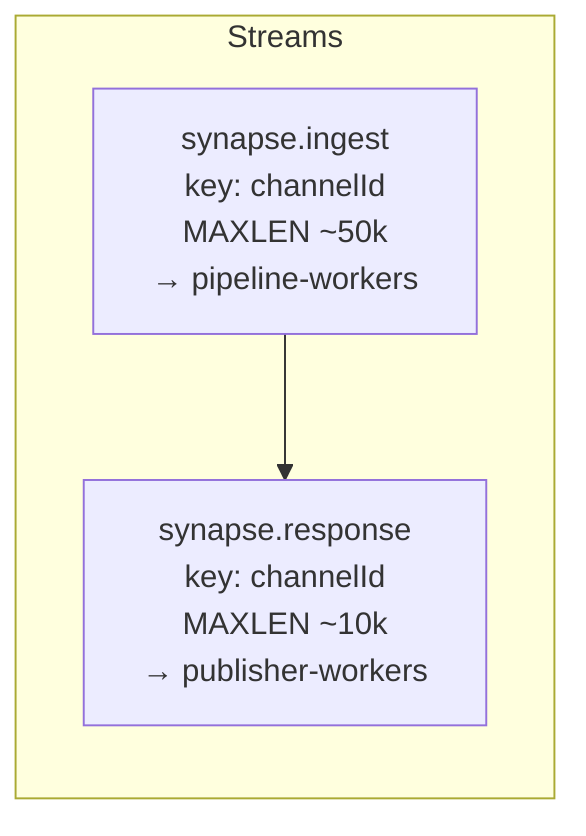
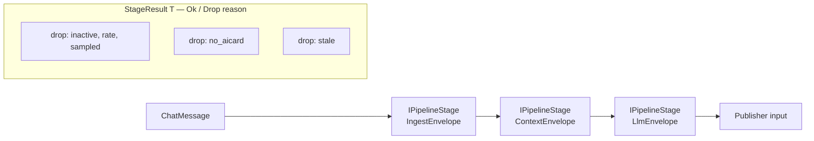
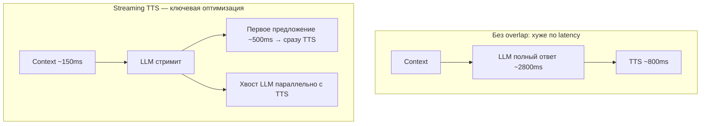
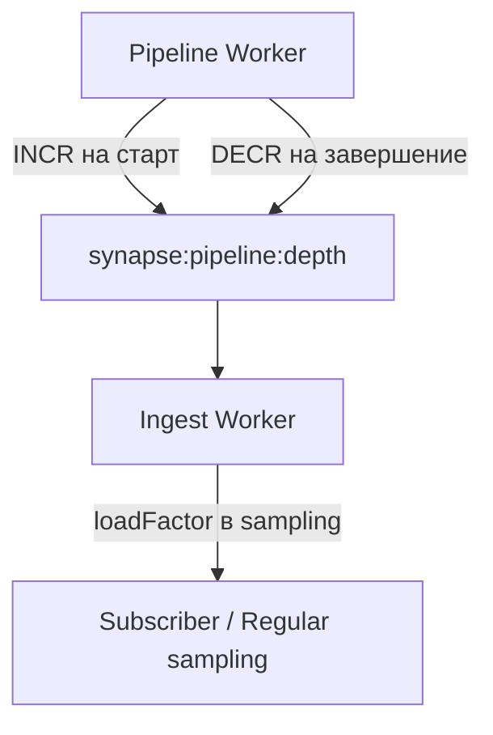
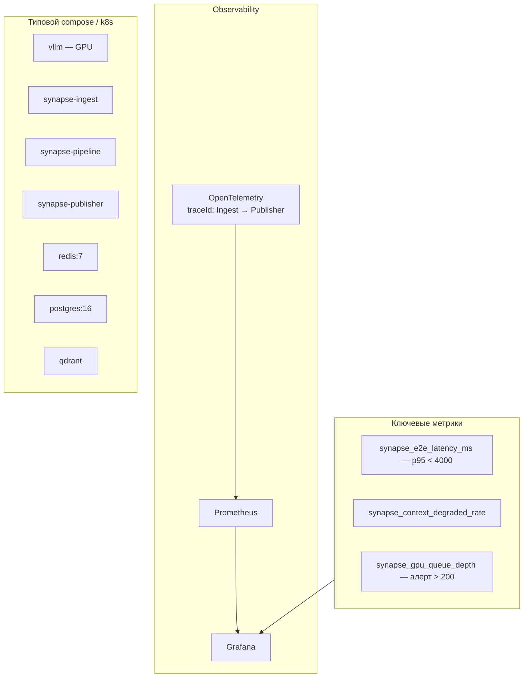
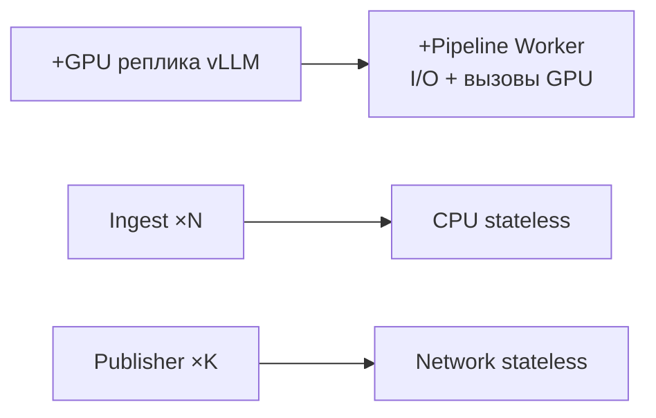

# Synapse — полная архитектура (Rethink + Ideal)

Сводная визуализация по [`SYNAPSE_ARCHITECTURE_RETHINK.md`](./SYNAPSE_ARCHITECTURE_RETHINK.md) и [`SYNAPSE_IDEAL_ARCHITECTURE.md`](./SYNAPSE_IDEAL_ARCHITECTURE.md). Диаграммы в Mermaid — рендерятся в GitHub, VS Code, многих IDE.

---

## 1. Контекст и latency budget

---

## 2. Сквозной поток (платформы → голос)

> В Rethink-документе очередь также обозначена как `synapse.pipeline` / `chat.input`; в Ideal зафиксированы имена **`synapse.ingest`** и **`synapse.response`** — на схеме используются они.

---

## 3. Топология Redis Streams (Ideal)

---

## 4. Внутри Pipeline: этапы и типизированный контракт (Ideal)

---

## 5. Streaming TTS vs «сначала весь LLM»

---

## 6. Backpressure (Ideal)

| depth | Поведение (упрощённо) |
|-------|------------------------|
| &lt; 200 | норма |
| 200–400 | loadFactor ~0.7 |
| 400–700 | loadFactor ~0.4 |
| &gt; 700 | loadFactor ~0.1 (приоритет donations / broadcasters) |

---

## 7. Наблюдаемость и деплой

---

## 8. Масштабирование (честная модель)

**Правило:** throughput вокруг LLM растёт в основном с **добавлением GPU / vLLM**; Ingest и Publisher скейлятся горизонтально проще.

---

## Как смотреть

| Где | Как |
|-----|-----|
| GitHub / GitLab | Открой этот `.md` — Mermaid встроен |
| VS Code | Расширение Markdown Preview Mermaid |
| Браузер | Открой [`synapse-architecture-viewer.html`](./synapse-architecture-viewer.html) в репозитории |

Если какая-то диаграмма не рендерится (старый рендерер), упрости вложенность `subgraph` или разбей на два файла.
